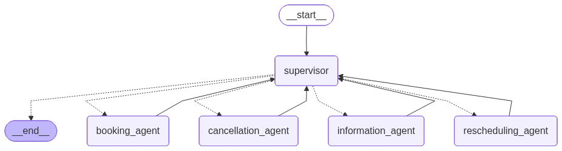

# Doctor Appointment Multi-Agentic Workflow

A conversational clinic assistant built with **LangGraph Supervisor** that routes patient requests to specialized AI agents for booking, cancellation, rescheduling, and information lookup — all backed by a live CSV data store.



---

## Architecture

The system follows a **supervisor pattern**: a top-level routing agent receives every patient message and delegates to the correct specialist agent. The supervisor never answers questions itself — it only dispatches.

```
Patient
  └─► Supervisor (GPT-4o)
        ├─► information_agent    — availability, specializations, queue position
        ├─► booking_agent        — book & view appointments
        ├─► cancellation_agent   — cancel appointments
        └─► rescheduling_agent   — move appointments (3-step atomic flow)
```

---

## Agents

### information_agent
Helps patients explore the clinic before committing to an appointment.

| Tool | Purpose |
|------|---------|
| `doctor_specializations_available()` | Lists all specializations offered |
| `get_doctor_by_specializations(specialization)` | Lists doctors for a given specialization |
| `doctors_available_timeslots(doctor_name, specialization)` | Shows open slots for a specific doctor |
| `queue_position(patient_id, doctor_name)` | Returns the patient's queue position |

### booking_agent
Handles appointment creation and retrieval.

| Tool | Purpose |
|------|---------|
| `appointment_booking(patient_id, specialization, doctor_name, date_slot?)` | Books the earliest or a specific slot |
| `view_all_booked_appointments(patient_id)` | Returns all upcoming appointments |
| `view_appointments_with_specialization(patient_id, specialization)` | Filters appointments by specialization |

### cancellation_agent
Cancels existing appointments after verifying the booking exists.

| Tool | Purpose |
|------|---------|
| `cancel_appointment(patient_id, doctor_name, date_slot)` | Cancels and frees the slot |

### rescheduling_agent
Moves an appointment in a guaranteed 3-step sequence to prevent double-booking or lost slots.

| Step | Tool | Action |
|------|------|--------|
| 1 | `get_available_slots_for_reschedule` | Shows new options to patient |
| 2 | `cancel_existing_appointment` | Releases the old slot |
| 3 | `book_rescheduled_appointment` | Confirms the new slot |

---

## Tech Stack

| Component | Technology |
|-----------|-----------|
| LLM | OpenAI GPT-4o |
| Agent framework | LangGraph + LangGraph Supervisor |
| Orchestration | LangChain |
| Data store | Pandas (CSV) |
| Observability | LangSmith |

---

## Project Structure

```
.
├── application.py              # Entry point — builds supervisor and runs chatbot loop
├── agents/
│   ├── information_agent.py    # Availability & queue tools
│   ├── booking_agent.py        # Booking & appointment view tools
│   ├── cancellation_agent.py   # Cancellation tool
│   └── rescheduling_agent.py   # 3-step reschedule tools
├── data artifacts/
│   └── doctor_availability.csv # Live appointment data
├── workflow_diagram.png        # Auto-generated LangGraph flow diagram
└── requirements.txt
```

---

## Setup

**1. Clone the repo**
```bash
git clone https://github.com/vinayk9490/Doctor-Appointment-Multi-Agentic-Workflow.git
cd Doctor-Appointment-Multi-Agentic-Workflow
```

**2. Create and activate a virtual environment**
```bash
python -m venv .venv
source .venv/bin/activate   # Windows: .venv\Scripts\activate
```

**3. Install dependencies**
```bash
pip install -r requirements.txt
```

**4. Configure environment variables**

Create a `.env` file in the project root (never commit this file):
```
OPENAI_API_KEY=your_openai_api_key
LANGCHAIN_API_KEY=your_langsmith_api_key
LANGCHAIN_TRACING_V2=true
LANGCHAIN_PROJECT=supervisor-multiagent-clinic
```

**5. Run the assistant**
```bash
python application.py
```

---

## Example Conversation

```
Clinic Assistant: Hello! How can I help you today?

You: What specializations do you offer?
Clinic Assistant: We offer Cardiology, Dermatology, Orthopedics, and General Medicine.

You: Book me an appointment with Dr. Smith in Cardiology. My ID is 1042.
Clinic Assistant: Appointment confirmed! Dr. Smith (Cardiology) on 2026-05-10 09:00:00 for patient 1042.

You: Actually, can you move that to a later date?
Clinic Assistant: Dr. Smith (Cardiology) has these open slots: [2026-05-12 10:00:00, 2026-05-14 14:00:00].
                  Which would you prefer?

You: May 14 at 2 PM.
Clinic Assistant: Appointment successfully rescheduled! Patient 1042 is now booked with Dr. Smith (Cardiology) on 2026-05-14 14:00:00.
```

---

## How Routing Works

The supervisor uses keyword and intent matching to decide which agent to call:

| Intent | Routed to |
|--------|----------|
| "What doctors do you have?", "Is Dr. X available?" | `information_agent` |
| "Book", "schedule", "show my appointments" | `booking_agent` |
| "Cancel", "remove", "delete" my appointment | `cancellation_agent` |
| "Reschedule", "move", "shift" my appointment | `rescheduling_agent` |

When intent is ambiguous between booking and rescheduling, the supervisor defaults to `booking_agent`.
